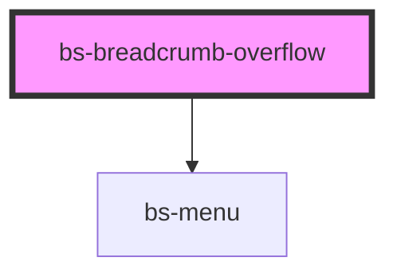

# bs-breadcrumb-overflow

<!-- Auto Generated Below -->

## Overview

A manually-placed collapsed-items disclosure for a `<bs-breadcrumbs>` trail: a leading separator
plus an icon-only ellipsis button that reveals a `bs-menu` popup listing every hidden crumb.

`items` is JS-property-only -- must be set as a JS property (`el.items = [...]`), not an HTML
attribute, since attributes can only carry strings. See CONVENTIONS.md.

Unlike an earlier `bs-breadcrumbs`-owned automatic `maxItems` collapse, this component does no
collapsing logic itself -- the consumer decides which crumbs to hide and places this element
wherever they want the disclosure, exactly matching Carbon Design System's own approach (Carbon
doesn't auto-collapse breadcrumbs either; a consumer there manually decides what's visible).

Hidden items with an `href` render as real `<a href>` rows inside the popup, not `bs-menu-item`
(which renders a `<button>`) -- this matters because consuming apps commonly use client-side
routers that intercept clicks on real `<a>` tags to do `preventDefault` + push-state navigation.
Rendering hidden links any other way (e.g. `window.location`) would silently break client-side
routing for hidden crumbs while working fine for visible ones. Hidden items without an `href`
render as plain non-interactive text, matching how `bs-breadcrumb` itself handles link vs.
no-link crumbs.

Sets `role="listitem"` on the host, mirroring Carbon's own `CDSBreadcrumbItem.connectedCallback()`
-- since this is a custom-element child of a real `<ol>` rather than a real `<li>`, the
accessibility tree needs this explicit role to preserve the list's semantics.

## When to use
- Inside a `<bs-breadcrumbs>` trail, wherever the consumer wants an interactive disclosure for
  crumbs they've chosen not to render directly.

## When not to use
- As an automatic collapsing mechanism -- there is none; the consumer decides what's hidden.

## Properties

| Property        | Attribute        | Description                                                                                                                                                                                                                                                                                                                                                                                                     | Type                         | Default                     |
| --------------- | ---------------- | --------------------------------------------------------------------------------------------------------------------------------------------------------------------------------------------------------------------------------------------------------------------------------------------------------------------------------------------------------------------------------------------------------------- | ---------------------------- | --------------------------- |
| `items`         | --               | Array prop -- must be set as a JS property (`el.items = [...]`), not an HTML attribute, since attributes can only carry strings. See CONVENTIONS.md. The hidden crumbs reachable via this disclosure -- no collapsing logic here, the consumer decides what goes in this list.                                                                                                                                  | `BsBreadcrumbOverflowItem[]` | `[]`                        |
| `overflowLabel` | `overflow-label` | Accessible name (`aria-label`) for the icon-only ellipsis trigger button.                                                                                                                                                                                                                                                                                                                                       | `string`                     | `'Show hidden breadcrumbs'` |
| `size`          | `size`           | Size variant. Normally set automatically by a parent `<bs-breadcrumbs size="...">` -- see `bs-breadcrumb`'s identical `size` prop doc comment for why this is propagated as a JS property rather than inherited via CSS. Scales the popup rows' font-size/line-height only; the separator/ellipsis icons' pixel sizes are unchanged. Reflected so consumers/CSS can target `bs-breadcrumb-overflow[size="sm"]`. | `"md" \| "sm"`               | `'md'`                      |

## Slots

| Slot | Description                                      |
| ---- | ------------------------------------------------ |
|      | None: `items` fully drives the popup's contents. |

## Shadow Parts

| Part          | Description                                          |
| ------------- | ---------------------------------------------------- |
| `"ellipsis"`  | The icon-only disclosure button.                     |
| `"link"`      | Each anchor/span row inside the popup.               |
| `"menu"`      | The `bs-menu` popup revealed by the ellipsis button. |
| `"separator"` | The leading separator icon wrapper.                  |

## CSS Custom Properties

| Name                                       | Description                                                                                                           |
| ------------------------------------------ | --------------------------------------------------------------------------------------------------------------------- |
| `--bs-breadcrumb-overflow-color`           | Text color of a row in the popup. Aliased to --bs-text-muted.                                                         |
| `--bs-breadcrumb-overflow-ellipsis-color`  | Ellipsis icon color. Aliased to --bs-icon-muted.                                                                      |
| `--bs-breadcrumb-overflow-font-size`       | Aliased to --bs-font-size-md.                                                                                         |
| `--bs-breadcrumb-overflow-font-size-sm`    | Popup row font size at size="sm". Aliased to --bs-font-size-sm.                                                       |
| `--bs-breadcrumb-overflow-gap`             | Gap between the separator icon and the ellipsis, and the popup's offset below the button. Aliased to --bs-spacing-50. |
| `--bs-breadcrumb-overflow-hover`           | Background color of a row in the popup on hover/focus. Aliased to --bs-color-neutral-container-hover.                 |
| `--bs-breadcrumb-overflow-line-height`     | Aliased to --bs-line-height-body-md.                                                                                  |
| `--bs-breadcrumb-overflow-line-height-sm`  | Popup row line height at size="sm". Aliased to --bs-line-height-body-sm.                                              |
| `--bs-breadcrumb-overflow-padding-x`       | Left/right padding of each row in the popup. Aliased to --bs-spacing-150.                                             |
| `--bs-breadcrumb-overflow-padding-y`       | Top/bottom padding of each row in the popup. Aliased to --bs-spacing-100.                                             |
| `--bs-breadcrumb-overflow-radius`          | Border radius of each row in the popup. Aliased to --bs-border-radius-100.                                            |
| `--bs-breadcrumb-overflow-separator-color` | Separator icon color. Aliased to --bs-icon-default.                                                                   |

## Dependencies

### Depends on

- [bs-menu](../../bs-menu)

### Graph

----------------------------------------------

*Built with [StencilJS](https://stenciljs.com/)*
