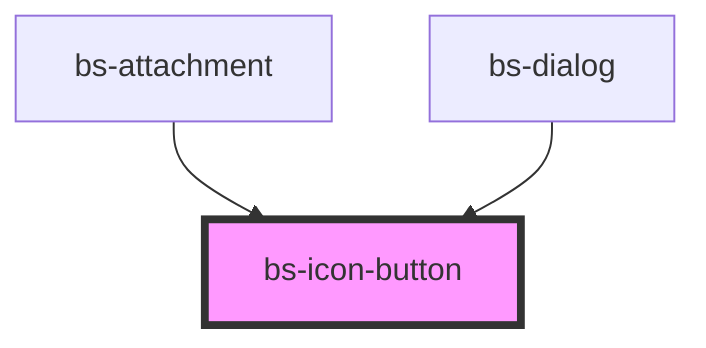

# bs-icon-button

<!-- Auto Generated Below -->

## Overview

A clickable, icon-only action element -- the icon-only sibling of `bs-button`, sharing the same
8 visual variants and color language, but ALWAYS rendering just a single icon, never a label.

## When to use
- A compact action where the icon alone is unambiguous (e.g. a close/dismiss control, a toolbar
  action) and adding a text label would take up more space than the context allows.
- The same variant guidance as `bs-button` applies: `primary` for the single most important
  action, `neutral`/`subtle`/`outlined` for lower-emphasis alternatives, `error` reserved for
  destructive/irreversible actions (never `neutral`, per BrandSync guidance), `success`/
  `warning`/`info` only when the action's own outcome is predictable and clearly communicated.

## When not to use
- When the action isn't self-evident from the icon alone -- use `bs-button` with a visible label
  instead, don't rely on a tooltip to compensate for an unclear icon.
- For navigation between pages -- use a link/nav component instead.

Because this component is always icon-only, `ariaLabel` is required for every real usage (not
just conditionally, unlike `bs-button`) -- there's no visible label text to fall back on for an
accessible name.

## Properties

| Property    | Attribute    | Description                                                                                                                                                                                                                                                                                       | Type                                                                                              | Default     |
| ----------- | ------------ | ------------------------------------------------------------------------------------------------------------------------------------------------------------------------------------------------------------------------------------------------------------------------------------------------- | ------------------------------------------------------------------------------------------------- | ----------- |
| `ariaLabel` | `aria-label` | Accessible name for the button. Required -- this component is always icon-only, so there's no visible label text for screen readers to fall back on. Stencil reflects this camelCase prop to the `aria-label` HTML attribute automatically.                                                       | `string`                                                                                          | `null`      |
| `disabled`  | `disabled`   | Disables the button and applies the disabled token set.                                                                                                                                                                                                                                           | `boolean`                                                                                         | `false`     |
| `size`      | `size`       | Sizing scale. `xs` (16px, an 8px icon) is a distinct, much smaller tier meant for compact chip/tag "remove" controls, not just a smaller toolbar button -- verified against a separate Figma redline (EG BrandSync UI Kit v1.5, node 20731:18427) from the one `sm`/`md`/`lg` were built against. | `"lg" \| "md" \| "sm" \| "xs"`                                                                    | `'md'`      |
| `type`      | `type`       | Native `<button>` type.                                                                                                                                                                                                                                                                           | `"button" \| "reset" \| "submit"`                                                                 | `'button'`  |
| `variant`   | `variant`    | Visual style. Maps to the same semantic token families as `bs-button`'s `variant`. `error` is for destructive/irreversible actions per BrandSync guidance, not a stronger emphasis alternative to `primary`.                                                                                      | `"error" \| "info" \| "neutral" \| "outlined" \| "primary" \| "subtle" \| "success" \| "warning"` | `'primary'` |

## Slots

| Slot | Description                                                 |
| ---- | ----------------------------------------------------------- |
|      | Default slot: the icon content. Exactly one icon, no label. |

## Shadow Parts

| Part     | Description               |
| -------- | ------------------------- |
| `"icon"` | The icon wrapper element. |

## CSS Custom Properties

| Name                                      | Description                                                                                                                                                                               |
| ----------------------------------------- | ----------------------------------------------------------------------------------------------------------------------------------------------------------------------------------------- |
| `--bs-icon-button-error-default`          | Background, variant="error", default. Aliased to --bs-color-error-default.                                                                                                                |
| `--bs-icon-button-error-disabled`         | Background, variant="error", disabled. Aliased to --bs-surface-action-disabled.                                                                                                           |
| `--bs-icon-button-error-focus`            | Focus ring color, variant="error". Aliased to --bs-border-error-focus.                                                                                                                    |
| `--bs-icon-button-error-hover`            | Background, variant="error", hover. Aliased to --bs-color-error-hover.                                                                                                                    |
| `--bs-icon-button-error-pressed`          | Background, variant="error", pressed. Aliased to --bs-color-error-pressed.                                                                                                                |
| `--bs-icon-button-icon-size-lg`           | Slotted icon width/height at size="lg". 24px.                                                                                                                                             |
| `--bs-icon-button-icon-size-md`           | Slotted icon width/height at size="md". 20px.                                                                                                                                             |
| `--bs-icon-button-icon-size-sm`           | Slotted icon width/height at size="sm". 16px.                                                                                                                                             |
| `--bs-icon-button-icon-size-xs`           | Slotted icon width/height at size="xs". 8px.                                                                                                                                              |
| `--bs-icon-button-info-default`           | Background, variant="info", default. Aliased to --bs-color-info-default.                                                                                                                  |
| `--bs-icon-button-info-disabled`          | Background, variant="info", disabled. Aliased to --bs-surface-action-disabled.                                                                                                            |
| `--bs-icon-button-info-focus`             | Focus ring color, variant="info". Aliased to --bs-border-info-focus.                                                                                                                      |
| `--bs-icon-button-info-hover`             | Background, variant="info", hover. Aliased to --bs-color-info-hover.                                                                                                                      |
| `--bs-icon-button-info-pressed`           | Background, variant="info", pressed. Aliased to --bs-color-info-pressed.                                                                                                                  |
| `--bs-icon-button-neutral-border`         | Border color, variant="neutral", default/disabled. Aliased to --bs-border-neutral-container.                                                                                              |
| `--bs-icon-button-neutral-border-hover`   | Border color, variant="neutral", hover. Aliased to --bs-border-neutral-container-hover.                                                                                                   |
| `--bs-icon-button-neutral-border-pressed` | Border color, variant="neutral", pressed. Aliased to --bs-border-neutral-container-pressed.                                                                                               |
| `--bs-icon-button-neutral-container`      | Background, variant="neutral", default/disabled. Aliased to --bs-color-neutral-container.                                                                                                 |
| `--bs-icon-button-neutral-hover`          | Background, variant="neutral", hover. Aliased to --bs-color-neutral-container-hover.                                                                                                      |
| `--bs-icon-button-neutral-pressed`        | Background, variant="neutral", pressed. Aliased to --bs-color-neutral-container-pressed.                                                                                                  |
| `--bs-icon-button-outlined-border`        | Border color, variant="outlined", default. Aliased to --bs-border-primary.                                                                                                                |
| `--bs-icon-button-outlined-border-hover`  | Border color, variant="outlined", hover/pressed. Aliased to --bs-border-primary-hover.                                                                                                    |
| `--bs-icon-button-outlined-container`     | Background, variant="outlined", hover/pressed. Aliased to --bs-color-primary-container.                                                                                                   |
| `--bs-icon-button-outlined-focus`         | Focus ring color, variant="outlined". Aliased to --bs-border-primary-focus.                                                                                                               |
| `--bs-icon-button-padding`                | Padding on all sides, all sizes (constant -- centers the icon inside the container at every size). Aliased to --bs-spacing-150.                                                           |
| `--bs-icon-button-padding-xs`             | Padding on all sides, size="xs" only -- distinct from --bs-icon-button-padding, since 16px/8px icon math (4px) differs from the sm/md/lg constant (12px). Aliased to --bs-spacing-50.     |
| `--bs-icon-button-primary-default`        | Background, variant="primary", default. Aliased to --bs-color-primary-default.                                                                                                            |
| `--bs-icon-button-primary-disabled`       | Background, variant="primary", disabled. Aliased to --bs-surface-action-disabled.                                                                                                         |
| `--bs-icon-button-primary-hover`          | Background, variant="primary", hover. Aliased to --bs-color-primary-hover.                                                                                                                |
| `--bs-icon-button-primary-pressed`        | Background, variant="primary", pressed. Aliased to --bs-color-primary-pressed.                                                                                                            |
| `--bs-icon-button-radius`                 | Corner radius, size="sm"/"md"/"lg". Aliased to --bs-border-radius-100.                                                                                                                    |
| `--bs-icon-button-radius-xs`              | Corner radius, size="xs" -- a smaller radius than --bs-icon-button-radius, since --bs-border-radius-100 (8px) on a 16px box would look nearly circular. Aliased to --bs-border-radius-50. |
| `--bs-icon-button-size-lg`                | Container width/height at size="lg". 48px.                                                                                                                                                |
| `--bs-icon-button-size-md`                | Container width/height at size="md". 44px.                                                                                                                                                |
| `--bs-icon-button-size-sm`                | Container width/height at size="sm". 40px.                                                                                                                                                |
| `--bs-icon-button-size-xs`                | Container width/height at size="xs". 16px.                                                                                                                                                |
| `--bs-icon-button-subtle-focus`           | Focus ring color, variant="subtle". Aliased to --bs-border-primary-focus.                                                                                                                 |
| `--bs-icon-button-subtle-hover`           | Background, variant="subtle", hover. Aliased to --bs-color-neutral-container.                                                                                                             |
| `--bs-icon-button-subtle-pressed`         | Background, variant="subtle", pressed. Aliased to --bs-color-neutral-container-pressed.                                                                                                   |
| `--bs-icon-button-success-default`        | Background, variant="success", default. Aliased to --bs-color-success-default.                                                                                                            |
| `--bs-icon-button-success-disabled`       | Background, variant="success", disabled. Aliased to --bs-surface-action-disabled.                                                                                                         |
| `--bs-icon-button-success-focus`          | Focus ring color, variant="success". Aliased to --bs-border-success-focus.                                                                                                                |
| `--bs-icon-button-success-hover`          | Background, variant="success", hover. Aliased to --bs-color-success-hover.                                                                                                                |
| `--bs-icon-button-success-pressed`        | Background, variant="success", pressed. Aliased to --bs-color-success-pressed.                                                                                                            |
| `--bs-icon-button-warning-default`        | Background, variant="warning", default. Aliased to --bs-color-warning-default.                                                                                                            |
| `--bs-icon-button-warning-disabled`       | Background, variant="warning", disabled. Aliased to --bs-surface-action-disabled.                                                                                                         |
| `--bs-icon-button-warning-focus`          | Focus ring color, variant="warning". Aliased to --bs-border-warning-focus.                                                                                                                |
| `--bs-icon-button-warning-hover`          | Background, variant="warning", hover. Aliased to --bs-color-warning-hover.                                                                                                                |
| `--bs-icon-button-warning-pressed`        | Background, variant="warning", pressed. Aliased to --bs-color-warning-pressed.                                                                                                            |

## Dependencies

### Used by

 - [bs-attachment](../../bs-attachment)
 - [bs-dialog](../../bs-dialog)

### Graph

----------------------------------------------

*Built with [StencilJS](https://stenciljs.com/)*
