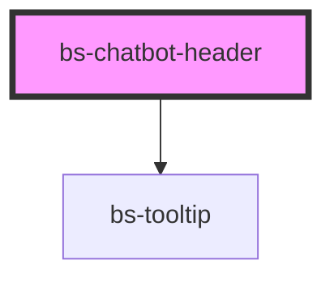

# bs-chatbot-header

<!-- Auto Generated Below -->

## Overview

The header bar that sits above `bs-composer` in a Genie AI chat panel: the Genie brand mark on
the left and four fixed actions (new chat, history, expand, close) on the right.

## When to use
- The top bar of a Genie AI chat panel, directly above a `bs-composer`.

## When not to use
- A generic app/page header — this component's layout and actions are purpose-built for the
  Genie chat panel, not a general navigation bar.

Each action button shows a `bs-tooltip` (placement="top", i.e. positioned below the button with
its arrow pointing up toward it -- fits naturally since this header sits at the top of a panel)
on hover/focus, driven by plain CSS (`:hover`/`:focus-within` on a wrapper, no extra JS state).
The tooltip is `aria-hidden` since it's a purely visual reinforcement of each button's existing
`aria-label` -- screen readers already get the accessible name from the button itself, so the
tooltip doesn't need to be (and shouldn't be) announced a second time.

## Properties

| Property   | Attribute  | Description                                                                                                                                                                                                                                                                                                                                                                                                                                                                                                                                         | Type      | Default   |
| ---------- | ---------- | --------------------------------------------------------------------------------------------------------------------------------------------------------------------------------------------------------------------------------------------------------------------------------------------------------------------------------------------------------------------------------------------------------------------------------------------------------------------------------------------------------------------------------------------------- | --------- | --------- |
| `expanded` | `expanded` | Whether the chat panel is currently expanded (e.g. to full viewport width/height). This component has no visibility into the surrounding layout, so it does not resize anything itself -- it only tracks and reflects the toggle state (via the `expanded` attribute, for CSS hooks, and `aria-pressed`/`aria-label` on the expand button) and emits `bsExpand` with the new value. The consuming app is responsible for actually resizing its own chat panel container in response to that event, since only the app knows what that container is. | `boolean` | `false`   |
| `heading`  | `heading`  | Accessible label for the header landmark, and alt text context for the logo image.                                                                                                                                                                                                                                                                                                                                                                                                                                                                  | `string`  | `'Genie'` |

## Events

| Event       | Description                                                                          | Type                   |
| ----------- | ------------------------------------------------------------------------------------ | ---------------------- |
| `bsClose`   | Fires when the "Close" button is clicked.                                            | `CustomEvent<void>`    |
| `bsExpand`  | Fires when the "Expand"/"Collapse" button is clicked, with the new `expanded` value. | `CustomEvent<boolean>` |
| `bsHistory` | Fires when the "History" button is clicked.                                          | `CustomEvent<void>`    |
| `bsNewChat` | Fires when the "New chat" button is clicked.                                         | `CustomEvent<void>`    |

## Slots

| Slot              | Description                                                                                                                                                                                                     |
| ----------------- | --------------------------------------------------------------------------------------------------------------------------------------------------------------------------------------------------------------- |
| `"close-icon"`    | Overrides the default "Close" button icon.                                                                                                                                                                      |
| `"expand-icon"`   | Overrides the default "Expand"/"Collapse" button icon (rendered regardless of `expanded` -- there is no separate confirmed "collapsed" glyph in the design, so swap it yourself via this slot if you need one). |
| `"history-icon"`  | Overrides the default "History" button icon.                                                                                                                                                                    |
| `"new-chat-icon"` | Overrides the default "New chat" button icon.                                                                                                                                                                   |

## Shadow Parts

| Part         | Description                          |
| ------------ | ------------------------------------ |
| `"close"`    | The "Close" icon button.             |
| `"expand"`   | The "Expand"/"Collapse" icon button. |
| `"history"`  | The "History" icon button.           |
| `"logo"`     | The Genie brand mark (inline SVG).   |
| `"new-chat"` | The "New chat" icon button.          |

## Dependencies

### Depends on

- [bs-tooltip](../bs-tooltip)

### Graph

----------------------------------------------

*Built with [StencilJS](https://stenciljs.com/)*
