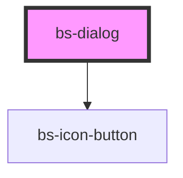

# bs-dialog

<!-- Auto Generated Below -->

## Overview

An overlay dialog that interrupts the current flow for a focused task or confirmation.
Closes itself on backdrop click, Escape, or its own close button, and emits `bsClose`.

## When to use
- Confirming a consequential action (e.g. "Confirm booking") before it takes effect.
- A short, focused task that doesn't warrant navigating to a new page.

## When not to use
- For non-blocking status messages — use a toast/notification instead of interrupting the user.
- For a long, multi-step flow — a full page or a dedicated route is usually a better fit than a
  dialog that just gets taller and taller.

Two additional slots cover the Figma "Dialog" component's other states: `image` (a hero image
across the top, close button floats over it instead of sitting in the header row) and `icon`
(only rendered when `centered` is set, e.g. a success checkmark above a centered heading). The
close button "floats" (absolute-positioned, top-right of the dialog, with its own background)
whenever `centered` is true or the `image` slot has content -- otherwise it's the plain inline
button in the header row next to the heading, same as before this addition.

## Properties

| Property   | Attribute  | Description                                                                                                                                                                                                                                                                                                                                                                                                                              | Type                   | Default     |
| ---------- | ---------- | ---------------------------------------------------------------------------------------------------------------------------------------------------------------------------------------------------------------------------------------------------------------------------------------------------------------------------------------------------------------------------------------------------------------------------------------- | ---------------------- | ----------- |
| `centered` | `centered` | Switches to the Figma "Icon Centered" layout: heading/body text centered, the `icon` slot rendered above the heading, and the close button floating top-right of the dialog instead of inline in the header row. Doesn't hide a slotted `image` if one is also provided -- Figma's spec doesn't show the two combined, so this is unspecified rather than actively blocked. Reflected so consumers/CSS can target `bs-dialog[centered]`. | `boolean`              | `false`     |
| `heading`  | `heading`  |                                                                                                                                                                                                                                                                                                                                                                                                                                          | `string`               | `undefined` |
| `open`     | `open`     | Mutable + reflected so the component can close itself (backdrop click, Escape, close button) the same way a native `<dialog>` does, while still emitting `bsClose` for the consumer to react to.                                                                                                                                                                                                                                         | `boolean`              | `false`     |
| `size`     | `size`     |                                                                                                                                                                                                                                                                                                                                                                                                                                          | `"lg" \| "md" \| "sm"` | `'md'`      |

## Events

| Event     | Description | Type                |
| --------- | ----------- | ------------------- |
| `bsClose` |             | `CustomEvent<void>` |

## Slots

| Slot       | Description                                                                                                                                                  |
| ---------- | ------------------------------------------------------------------------------------------------------------------------------------------------------------ |
|            | Default slot: the dialog body content.                                                                                                                       |
| `"footer"` | Optional footer content (typically action buttons).                                                                                                          |
| `"icon"`   | Optional icon shown above the heading, only rendered at all when `centered` is true.                                                                         |
| `"image"`  | Optional hero image across the top of the dialog. Presence of assigned content switches the close button to float over it; doesn't affect layout when empty. |

## Shadow Parts

| Part         | Description                                                                      |
| ------------ | -------------------------------------------------------------------------------- |
| `"backdrop"` | The full-viewport overlay behind the dialog.                                     |
| `"body"`     | The body content wrapper.                                                        |
| `"close"`    | The close button (inline in the header, or floating -- see the class doc above). |
| `"dialog"`   | The dialog box itself.                                                           |
| `"footer"`   | The footer wrapper (only visible when the footer slot has content).              |
| `"header"`   | The header row (heading + close button, when the close button isn't floating).   |
| `"icon"`     | The icon wrapper (only rendered when `centered` is true).                        |
| `"image"`    | The hero image wrapper (only visible when the `image` slot has content).         |

## Dependencies

### Depends on

- [bs-icon-button](../bs-button/bs-icon-button)

### Graph

----------------------------------------------

*Built with [StencilJS](https://stenciljs.com/)*
