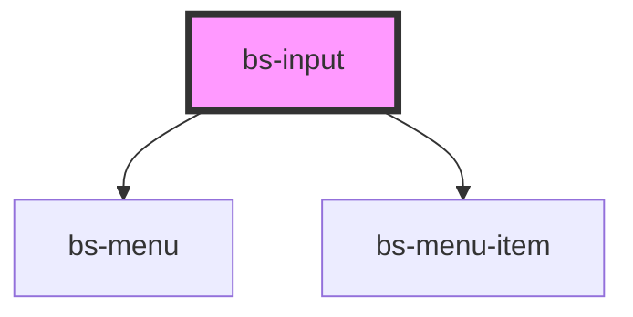

# bs-input

<!-- Auto Generated Below -->

## Overview

A single-line text field with an optional label, description, and error state. Also covers a
range of related "field" shapes (number stepper, password reveal, date, dropdown trigger,
select, textarea, chip input, initials, country, and pin) via the `type` prop, since they all
share the same label/description/error/icon-slot chrome.

## When to use
- Collecting a single line of free-text, email, password, or numeric input.
- Any of the other supported `type`s (search, date, dropdown, select, textarea, chip, initials,
  country, pin) that share this component's label/description/error chrome.
- Pair with `error` for inline validation feedback tied to that specific field.

## When not to use
- A fixed set of choices best served by a dedicated radio/checkbox group rather than a single
  field. `type="select"` (native `<select>`) and `type="dropdown"` (a `bs-menu` of
  `bs-menu-item`s from the `options` prop) cover the field-shaped cases; `type="chip"` has no
  options list at all (freeform chip entry).

## Properties

| Property         | Attribute        | Description                                                                                                                                                                                                                                          | Type                                                                                                                                                      | Default     |
| ---------------- | ---------------- | ---------------------------------------------------------------------------------------------------------------------------------------------------------------------------------------------------------------------------------------------------- | --------------------------------------------------------------------------------------------------------------------------------------------------------- | ----------- |
| `chips`          | --               | Current chips for `type="chip"`. Must be set as a JS property, not an HTML attribute -- see CONVENTIONS.md's non-string props rule.                                                                                                                  | `string[]`                                                                                                                                                | `[]`        |
| `country`        | `country`        | Current selected country code for `type="country"`.                                                                                                                                                                                                  | `string`                                                                                                                                                  | `''`        |
| `countryOptions` | --               | Country select options for `type="country"`. Must be set as a JS property, not an HTML attribute -- see CONVENTIONS.md's non-string props rule.                                                                                                      | `{ code: string; label: string; flagIcon?: string; }[]`                                                                                                   | `[]`        |
| `description`    | `description`    |                                                                                                                                                                                                                                                      | `string`                                                                                                                                                  | `undefined` |
| `disabled`       | `disabled`       |                                                                                                                                                                                                                                                      | `boolean`                                                                                                                                                 | `false`     |
| `error`          | `error`          |                                                                                                                                                                                                                                                      | `string`                                                                                                                                                  | `undefined` |
| `initialsTitle`  | `initials-title` | Current selected title for `type="initials"`. Named `initialsTitle` rather than `title` -- `title` is a reserved standard HTML attribute (tooltip text) inherited by every element, and Stencil warns against shadowing it with a component `@Prop`. | `string`                                                                                                                                                  | `''`        |
| `label`          | `label`          |                                                                                                                                                                                                                                                      | `string`                                                                                                                                                  | `undefined` |
| `length`         | `length`         | Number of cells for `type="pin"`.                                                                                                                                                                                                                    | `number`                                                                                                                                                  | `4`         |
| `max`            | `max`            | Maximum value for `type="number"`'s stepper buttons.                                                                                                                                                                                                 | `number`                                                                                                                                                  | `undefined` |
| `min`            | `min`            | Minimum value for `type="number"`'s stepper buttons.                                                                                                                                                                                                 | `number`                                                                                                                                                  | `undefined` |
| `open`           | `open`           | Whether the `type="dropdown"` trigger is open. Reflects to an attribute so consumers can style an open state via CSS. When `options` is non-empty, this also controls whether the `bs-menu` of `bs-menu-item`s is rendered below the field.          | `boolean`                                                                                                                                                 | `false`     |
| `options`        | --               | Options for `type="select"` (rendered as native `<option>`s) and `type="dropdown"` (rendered as a `bs-menu` of `bs-menu-item`s when `open`). Must be set as a JS property, not an HTML attribute -- see CONVENTIONS.md's non-string props rule.      | `{ label: string; value: string; }[]`                                                                                                                     | `[]`        |
| `placeholder`    | `placeholder`    |                                                                                                                                                                                                                                                      | `string`                                                                                                                                                  | `undefined` |
| `required`       | `required`       | Marks the field as required: renders a red `*` after the label and sets `aria-required="true"` on the control. Applies regardless of `type`.                                                                                                         | `boolean`                                                                                                                                                 | `false`     |
| `rows`           | `rows`           | Number of visible rows for `type="textarea"`.                                                                                                                                                                                                        | `number`                                                                                                                                                  | `3`         |
| `step`           | `step`           | Step size for `type="number"`'s increment/decrement stepper buttons.                                                                                                                                                                                 | `number`                                                                                                                                                  | `1`         |
| `titleOptions`   | --               | Title select options for `type="initials"` (e.g. `['Mrs.', 'Mr.', 'Dr.']`). Must be set as a JS property, not an HTML attribute -- see CONVENTIONS.md's non-string props rule.                                                                       | `string[]`                                                                                                                                                | `[]`        |
| `type`           | `type`           |                                                                                                                                                                                                                                                      | `"chip" \| "country" \| "date" \| "dropdown" \| "email" \| "initials" \| "number" \| "password" \| "pin" \| "search" \| "select" \| "text" \| "textarea"` | `'text'`    |
| `value`          | `value`          | Current value. Native `input`/`change` events don't cross the Shadow DOM boundary, so this component re-dispatches them as `bsInput`/`bsChange` custom events instead. Mutable so the `number` type's stepper buttons can update it directly.        | `string`                                                                                                                                                  | `''`        |

## Events

| Event             | Description                                                                                                          | Type                   |
| ----------------- | -------------------------------------------------------------------------------------------------------------------- | ---------------------- |
| `bsChange`        |                                                                                                                      | `CustomEvent<string>`  |
| `bsChipAdd`       | Emitted when a chip is committed (Enter pressed in the draft input) for `type="chip"`.                               | `CustomEvent<string>`  |
| `bsChipRemove`    | Emitted when a chip's remove button is clicked for `type="chip"`.                                                    | `CustomEvent<string>`  |
| `bsCountryChange` | Emitted when the country `<select>` changes for `type="country"`.                                                    | `CustomEvent<string>`  |
| `bsInput`         |                                                                                                                      | `CustomEvent<string>`  |
| `bsOpen`          | Emitted when `type="dropdown"`'s trigger is toggled. See `open`'s doc comment for this type's shell-only limitation. | `CustomEvent<boolean>` |
| `bsTitleChange`   | Emitted when the title `<select>` changes for `type="initials"`.                                                     | `CustomEvent<string>`  |

## Slots

| Slot         | Description                                                                                                                                                                                                                                                                                                                                                                       |
| ------------ | --------------------------------------------------------------------------------------------------------------------------------------------------------------------------------------------------------------------------------------------------------------------------------------------------------------------------------------------------------------------------------- |
| `"end-icon"` | Optional trailing icon, rendered after the native control (e.g. a chevron for a field that opens a picker). Ignored when `type` is `number` (stepper buttons), `password` (show/hide toggle), or `dropdown` (chevron) -- those types always render their own trailing control there. For `type="date"`, the slot is used if provided, otherwise a default calendar icon is shown. |
| `"icon"`     | Optional leading icon, rendered before the native control (e.g. a mail icon for an email field). For `type="search"`, the slot is used if provided, otherwise a default magnifying-glass icon is shown.                                                                                                                                                                           |

## Shadow Parts

| Part            | Description                                                                                                                                                                                                                                                                                                                                                                                                                                                                                                                                                                                          |
| --------------- | ---------------------------------------------------------------------------------------------------------------------------------------------------------------------------------------------------------------------------------------------------------------------------------------------------------------------------------------------------------------------------------------------------------------------------------------------------------------------------------------------------------------------------------------------------------------------------------------------------- |
| `"chip"`        | A single chip pill, when `type="chip"`.                                                                                                                                                                                                                                                                                                                                                                                                                                                                                                                                                              |
| `"control"`     | The native control element (`<input>`, `<select>`, or `<textarea>` depending on `type`). Composite types (`initials`, `country`) render this part on more than one element.                                                                                                                                                                                                                                                                                                                                                                                                                          |
| `"description"` | The helper text element (hidden when `error` is set).                                                                                                                                                                                                                                                                                                                                                                                                                                                                                                                                                |
| `"end-icon"`    | The trailing icon wrapper element.                                                                                                                                                                                                                                                                                                                                                                                                                                                                                                                                                                   |
| `"error"`       | The error message element.                                                                                                                                                                                                                                                                                                                                                                                                                                                                                                                                                                           |
| `"error-icon"`  | The warning icon shown before the error message.                                                                                                                                                                                                                                                                                                                                                                                                                                                                                                                                                     |
| `"field"`       | The bordered field wrapper containing the icon(s) and native control(s). `type="initials"` renders this part on TWO separate elements instead of one (the title `<select>`'s own small box, and the name `<input>`'s own box) -- Figma specs these as two genuinely independent bordered containers with a gap between them, not one shared field the way every other composite type (`country` included) renders, so `::part(field)` reaches whichever of the two a given selector context matches, same "multiple elements, one shared part name" convention as `bs-attachment`'s own `star` part. |
| `"icon"`        | The leading icon wrapper element.                                                                                                                                                                                                                                                                                                                                                                                                                                                                                                                                                                    |
| `"label"`       | The `<label>` element.                                                                                                                                                                                                                                                                                                                                                                                                                                                                                                                                                                               |
| `"menu"`        | The `bs-menu` rendered below the field for `type="dropdown"` when `open` and `options` is non-empty.                                                                                                                                                                                                                                                                                                                                                                                                                                                                                                 |
| `"required"`    | The red `*` rendered after the label text when `required` is set.                                                                                                                                                                                                                                                                                                                                                                                                                                                                                                                                    |

## CSS Custom Properties

| Name                              | Description                                                                                                                                                                                                                                                                                                                                                                                                                                                                                                            |
| --------------------------------- | ---------------------------------------------------------------------------------------------------------------------------------------------------------------------------------------------------------------------------------------------------------------------------------------------------------------------------------------------------------------------------------------------------------------------------------------------------------------------------------------------------------------------- |
| `--bs-input-chip-bg`              | Chip pill background for type="chip". Aliased to --bs-input-bg-disabled.                                                                                                                                                                                                                                                                                                                                                                                                                                               |
| `--bs-input-chip-text`            | Chip pill text color for type="chip". Aliased to --bs-input-text.                                                                                                                                                                                                                                                                                                                                                                                                                                                      |
| `--bs-input-description-color`    | Description text color. Aliased to --bs-input-description.                                                                                                                                                                                                                                                                                                                                                                                                                                                             |
| `--bs-input-error-color`          | Error message text color. Aliased to --bs-input-error.                                                                                                                                                                                                                                                                                                                                                                                                                                                                 |
| `--bs-input-error-icon-size`      | Width/height of the warning icon shown before the error message. Aliased to --bs-spacing-250.                                                                                                                                                                                                                                                                                                                                                                                                                          |
| `--bs-input-field-bg`             | Field background. Aliased to --bs-input-bg-default.                                                                                                                                                                                                                                                                                                                                                                                                                                                                    |
| `--bs-input-field-bg-disabled`    | Field background when disabled is set. Aliased to --bs-input-bg-disabled.                                                                                                                                                                                                                                                                                                                                                                                                                                              |
| `--bs-input-field-border`         | Field border color. Aliased to --bs-input-border-default.                                                                                                                                                                                                                                                                                                                                                                                                                                                              |
| `--bs-input-field-border-error`   | Field border color when error is set. Aliased to --bs-input-border-error.                                                                                                                                                                                                                                                                                                                                                                                                                                              |
| `--bs-input-field-border-focus`   | Field border color when focused. Aliased to --bs-input-border-focus.                                                                                                                                                                                                                                                                                                                                                                                                                                                   |
| `--bs-input-field-border-hover`   | Field border color on hover. Aliased to --bs-input-border-hover.                                                                                                                                                                                                                                                                                                                                                                                                                                                       |
| `--bs-input-field-placeholder`    | Placeholder text color. Aliased to --bs-input-placeholder.                                                                                                                                                                                                                                                                                                                                                                                                                                                             |
| `--bs-input-field-text`           | Input text color. Aliased to --bs-input-text.                                                                                                                                                                                                                                                                                                                                                                                                                                                                          |
| `--bs-input-gap`                  | Gap between the icon(s) and the native input. Aliased to --bs-spacing-200.                                                                                                                                                                                                                                                                                                                                                                                                                                             |
| `--bs-input-height`               | Height of the field. Aliased to --bs-spacing-600.                                                                                                                                                                                                                                                                                                                                                                                                                                                                      |
| `--bs-input-icon-color`           | Icon color in the default state. Aliased to --bs-icon-muted.                                                                                                                                                                                                                                                                                                                                                                                                                                                           |
| `--bs-input-icon-color-disabled`  | Icon color when disabled is set. Aliased to --bs-input-icon-disabled.                                                                                                                                                                                                                                                                                                                                                                                                                                                  |
| `--bs-input-icon-color-error`     | Icon color when error is set. Aliased to --bs-input-icon-error.                                                                                                                                                                                                                                                                                                                                                                                                                                                        |
| `--bs-input-icon-size`            | Width/height of the leading/trailing icon. Aliased to --bs-spacing-300.                                                                                                                                                                                                                                                                                                                                                                                                                                                |
| `--bs-input-initials-gap`         | Gap between the title box and the name box for type="initials". Aliased to --bs-spacing-50 (4px), matching Figma's own gap-[4px] on this same pairing exactly.                                                                                                                                                                                                                                                                                                                                                         |
| `--bs-input-initials-title-width` | Width of the title box for type="initials" (e.g. "Mrs."/"Mr."/"Dr."). A literal 80px, not aliased to a spacing token -- Figma specs this sub-field as a fixed, compact width regardless of option content (node 10306:101047), not content-based sizing. Applied to the box itself (`.bs-input__field--initials-title`), not the `<select>` directly -- see that class's own comment for why type="initials" renders two separate bordered boxes instead of sharing one field the way every other composite type does. |
| `--bs-input-label-color`          | Label text color. Aliased to --bs-input-label.                                                                                                                                                                                                                                                                                                                                                                                                                                                                         |
| `--bs-input-padding-x`            | Horizontal padding inside the field. Aliased to --bs-spacing-150.                                                                                                                                                                                                                                                                                                                                                                                                                                                      |
| `--bs-input-padding-y`            | Vertical padding inside the field. Aliased to --bs-spacing-100.                                                                                                                                                                                                                                                                                                                                                                                                                                                        |
| `--bs-input-radius`               | Corner radius of the field. Aliased to --bs-border-radius-100.                                                                                                                                                                                                                                                                                                                                                                                                                                                         |
| `--bs-input-stack-gap`            | Vertical gap between the label, field, and description/error. Aliased to --bs-spacing-50.                                                                                                                                                                                                                                                                                                                                                                                                                              |

## Dependencies

### Depends on

- [bs-menu](../bs-menu)
- [bs-menu-item](../bs-menu-item)

### Graph

----------------------------------------------

*Built with [StencilJS](https://stenciljs.com/)*
