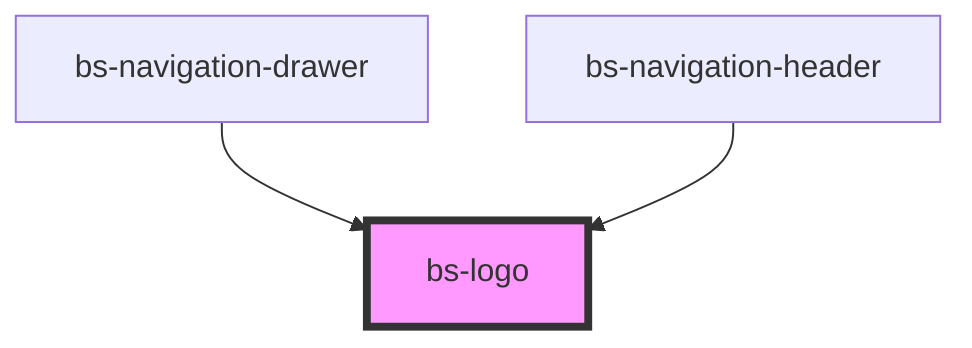

# bs-logo

<!-- Auto Generated Below -->

## Overview

The BrandSync brand mark, as its own standalone component -- shared by `bs-navigation-header`
and `bs-navigation-drawer`, which used to each render their own duplicated copy of this SVG
(the drawer's collapsed state even faked an icon-only look by clipping the full wordmark asset
down to a narrowed box, rather than using a real icon-only asset).

## When to use
- Anywhere the BrandSync logo/icon needs to render: a navigation header, a nav drawer, etc.

## When not to use
- The Genie AI chat panel's own brand mark -- that's a different logo (`bs-chatbot-header`'s
  own inline Genie asset), not this one.

`variant` mirrors Figma's "Logo" component set (node 10909:30421) `Device` property
("Desktop" / "Tab and mobile"), which was originally meant to distinguish the full lockup from
the icon-only mark at different responsive breakpoints -- renamed here to
`variant: 'full' | 'mark'` since that's what it actually controls (how much of the logo
renders), not literally a device/breakpoint switch.

`variant="custom"` is not a Figma variant at all -- it's an escape hatch for a consuming app
that needs to show a DIFFERENT product's logo in the same slot (e.g. a white-labeled deployment,
or a logo fetched at runtime from a service like brand.dev), via `src`/`alt`, instead of the
built-in BrandSync assets. This component deliberately does NOT fetch that image itself --
network calls, loading/error states, and caching are the consuming app's responsibility, same as
every other component in this library (e.g. `bs-attachment` takes `imageSrc` rather than fetching
an image on its own). `background` has no effect on `variant="custom"` -- a consumer's own image
is already designed for whatever surface it's placed on.

## Properties

| Property     | Attribute    | Description                                                                                                                                                                                                                                                                                                                                                                                                                                                                                                                                                                                                                                                                                                                                                                                                                                                                                                                                                                                                                                                                                                                                                                                                                                                   | Type                           | Default  |
| ------------ | ------------ | ------------------------------------------------------------------------------------------------------------------------------------------------------------------------------------------------------------------------------------------------------------------------------------------------------------------------------------------------------------------------------------------------------------------------------------------------------------------------------------------------------------------------------------------------------------------------------------------------------------------------------------------------------------------------------------------------------------------------------------------------------------------------------------------------------------------------------------------------------------------------------------------------------------------------------------------------------------------------------------------------------------------------------------------------------------------------------------------------------------------------------------------------------------------------------------------------------------------------------------------------------------- | ------------------------------ | -------- |
| `alt`        | `alt`        | `variant="custom"` only: accessible alt text for the image -- a product logo is meaningful content (whose brand is this?), not decorative, so set this to something real (e.g. the product/company name). Falls back to `alt=""` (marking the image decorative to assistive tech) when unset, rather than omitting the `alt` attribute entirely -- an `` with no `alt` attribute at all is a harder accessibility failure than one explicitly marked decorative, but an empty fallback is still worse than a real name, so don't rely on it. Ignored for `full`/`mark` (those already carry their own fixed `aria-label="BrandSync"`).                                                                                                                                                                                                                                                                                                                                                                                                                                                                                                                                                                                                                   | `string`                       | `null`   |
| `background` | `background` | Which pre-built asset to use for `variant="full"` -- Figma ships a genuinely separate, differently-drawn dark-background asset (every wordmark path filled solid white, and the icon's outer shape a single solid-white path instead of the light version's two-path white-fill-plus-border-ring), not a CSS currentColor swap of identical paths.  `"auto"` (default) renders both assets and lets CSS pick one via `--bs-logo-asset-light-display`/`--bs-logo-asset-dark-display` (defined in `src/global/base.css`, flipped by the same `[data-theme="dark"]` attribute every other `--bs-*` token already reacts to) -- so the logo just follows the ambient theme with no wiring needed, the same way a consuming app's own dark mode already re-themes every other part of this library via ordinary CSS custom property inheritance. Set `"light"`/`"dark"` explicitly to pin one regardless of the ambient theme -- e.g. a dark sidebar that isn't otherwise dark-themed.  Has no effect on `variant="mark"`: Figma's component set only has one real designed instance of the icon-only mark (`Device="Tab and mobile"`, `Background="Default"`) -- there's no separate dark version of it, so the mark renders identically regardless of this prop. | `"auto" \| "dark" \| "light"`  | `'auto'` |
| `src`        | `src`        | `variant="custom"` only: the image URL to render (e.g. a URL your app already fetched from a logo API). Ignored for `full`/`mark`.                                                                                                                                                                                                                                                                                                                                                                                                                                                                                                                                                                                                                                                                                                                                                                                                                                                                                                                                                                                                                                                                                                                            | `string`                       | `null`   |
| `variant`    | `variant`    | How much of the logo to render. `full` is the icon + "EG BrandSync" wordmark (190.977x44 natural size); `mark` is just the icon (44x44 natural size), no wordmark; `custom` renders a consumer-supplied image via `src`/`alt` instead of a built-in BrandSync asset -- see the class doc above.                                                                                                                                                                                                                                                                                                                                                                                                                                                                                                                                                                                                                                                                                                                                                                                                                                                                                                                                                               | `"custom" \| "full" \| "mark"` | `'full'` |

## Shadow Parts

| Part     | Description                       |
| -------- | --------------------------------- |
| `"logo"` | The rendered SVG/image's wrapper. |

## CSS Custom Properties

| Name                            | Description                                                                                                                                                                                                                                                                                                                                            |
| ------------------------------- | ------------------------------------------------------------------------------------------------------------------------------------------------------------------------------------------------------------------------------------------------------------------------------------------------------------------------------------------------------ |
| `--bs-logo-asset-dark-display`  | The background="auto" counterpart to --bs-logo-asset-light-display above -- see that entry.                                                                                                                                                                                                                                                            |
| `--bs-logo-asset-light-display` | Only read when background="auto" (the default). Defined in src/global/base.css, not here -- that's this library's own bridge from the ambient [data-theme="dark"] attribute to which full-wordmark asset shows, not a per-component override point most consumers need to touch directly.                                                              |
| `--bs-logo-height-custom`       | Height of the rendered image when variant="custom". Width is `auto` (not a fixed custom property) so a consumer's own logo keeps its natural aspect ratio -- only the height is constrained, matching `full`/`mark`'s shared 44px height. Defaults to 44px.                                                                                            |
| `--bs-logo-height-full`         | Height of the rendered logo when variant="full". 44px.                                                                                                                                                                                                                                                                                                 |
| `--bs-logo-height-mark`         | Height of the rendered logo when variant="mark". 44px.                                                                                                                                                                                                                                                                                                 |
| `--bs-logo-width-full`          | Width of the rendered logo when variant="full". 190.977px -- the light asset's natural width after its icon-to-wordmark gap was tightened from Figma's own exported spacing (see brandsync-logo-full-light.ts) -- a literal size, not a brandsync-tokens alias, since this is a fixed asset's natural dimensions rather than a themeable design token. |
| `--bs-logo-width-mark`          | Width of the rendered logo when variant="mark". 44px.                                                                                                                                                                                                                                                                                                  |

## Dependencies

### Used by

 - [bs-navigation-drawer](../ui-shell/bs-navigation-drawer/bs-navigation-drawer)
 - [bs-navigation-header](../ui-shell/bs-navigation-header/bs-navigation-header)

### Graph

----------------------------------------------

*Built with [StencilJS](https://stenciljs.com/)*
