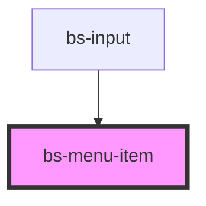

# bs-menu-item

<!-- Auto Generated Below -->

## Overview

A single selectable row inside a `bs-menu`: an optional icon plus a text label, rendered as a
real `<button>` for correct keyboard/click semantics.

## When to use
- As a child of `bs-menu`, one per selectable action/option.

## When not to use
- Outside of `bs-menu` -- this component's sizing/hover treatment is designed to sit inside the
  menu's rounded, padded list box.

## Properties

| Property   | Attribute  | Description                                                                                                                                        | Type      | Default |
| ---------- | ---------- | -------------------------------------------------------------------------------------------------------------------------------------------------- | --------- | ------- |
| `disabled` | `disabled` | Disables the item: no hover/pressed/focus styling, no pointer cursor, not reachable by keyboard tabbing, and clicking it does not emit `bsSelect`. | `boolean` | `false` |

## Events

| Event      | Description                     | Type                |
| ---------- | ------------------------------- | ------------------- |
| `bsSelect` | Fires when the item is clicked. | `CustomEvent<void>` |

## Slots

| Slot     | Description                                                                |
| -------- | -------------------------------------------------------------------------- |
|          | Default slot: the item's text label.                                       |
| `"icon"` | Optional leading icon (24x24). When left empty, no icon space is reserved. |

## Shadow Parts

| Part      | Description         |
| --------- | ------------------- |
| `"icon"`  | The icon wrapper.   |
| `"item"`  | The button element. |
| `"label"` | The label wrapper.  |

## Dependencies

### Used by

 - [bs-input](../bs-input)

### Graph

----------------------------------------------

*Built with [StencilJS](https://stenciljs.com/)*
