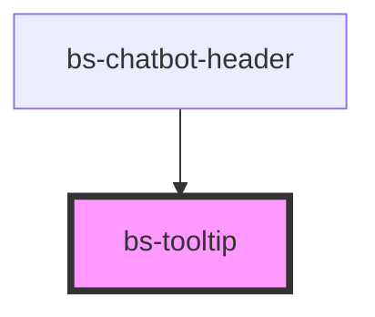

# bs-tooltip

<!-- Auto Generated Below -->

## Overview

A dark tooltip bubble with a pointer arrow, used to surface a short hint of extra information
next to a trigger element.

`bs-tooltip` is a purely presentational bubble -- like `bs-menu`, it does not manage its own
visibility, hover/focus triggering, or positioning relative to a trigger element. A consuming
app is responsible for showing/hiding it and for positioning it against its trigger (e.g. via a
wrapping `position: relative`/`absolute` pattern, the same approach used by
`bs-chatbot-response-action` for its own `menu` slot).

## When to use
- A short, contextual hint of extra information shown next to a trigger element on hover/focus,
  where the host app owns the show/hide and positioning logic.

## When not to use
- A component that manages its own trigger interaction (hover/focus listeners) or positioning --
  this component intentionally does not do that; wire that up in the consuming app instead.

## Properties

| Property    | Attribute   | Description                                                                                                                                                                                                                                                                                                                                                                   | Type    | Default |
| ----------- | ----------- | ----------------------------------------------------------------------------------------------------------------------------------------------------------------------------------------------------------------------------------------------------------------------------------------------------------------------------------------------------------------------------- | ------- | ------- |
| `placement` | `placement` | Which edge of the bubble the arrow points from, and therefore which side of a trigger the bubble should be placed on. `'top'` is the only value implemented -- it is the only variant confirmed from the Figma "EG Tooltip" component (arrow at the top of the bubble, pointing up). Bottom/left/right variants aren't implemented pending further Figma design confirmation. | `"top"` | `'top'` |

## Slots

| Slot | Description                                  |
| ---- | -------------------------------------------- |
|      | Default slot: the tooltip's message content. |

## Shadow Parts

| Part       | Description                                          |
| ---------- | ---------------------------------------------------- |
| `"arrow"`  | The triangular pointer arrow.                        |
| `"bubble"` | The dark rounded box containing the slotted content. |

## Dependencies

### Used by

 - [bs-chatbot-header](../bs-chatbot-header)

### Graph

----------------------------------------------

*Built with [StencilJS](https://stenciljs.com/)*
