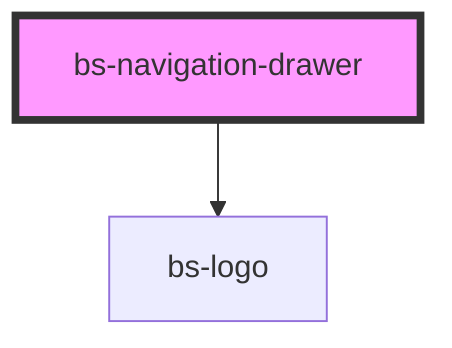

# bs-navigation-drawer

<!-- Auto Generated Below -->

## Overview

A left-side persistent navigation sidebar: the BrandSync logo, a "Main Menu" title with a
collapse toggle, a reserved slot for a search field, and a scrollable list of nav items.

## When to use
- The primary in-app navigation, shown alongside `bs-navigation-header` (typically that
  header's `with-navigation-drawer` alignment, which omits its own logo since this component
  already renders one).

## When not to use
- The top navigation bar itself -- use `bs-navigation-header` instead.

This component renders a real `<nav>` landmark (no explicit `role` needed -- `<nav>` already
carries the implicit `navigation` role), labeled via `aria-label={heading}` so the landmark
still has a name even when collapsed (see below).

`collapsed` narrows the drawer to a 96px icon-only rail, per Figma node 8028:135374
("Type=Collapsed"): the title text disappears, the logo swaps from the full "EG BrandSync"
wordmark (`bs-logo variant="full"`) to the real icon-only mark (`bs-logo variant="mark"` -- a
second, properly-designed asset, not a CSS crop of the full one) via CSS visibility toggling on
both, the same `:host([collapsed])` attribute-selector pattern already used for the
`search`/`search-trigger` swap below, the `search` slot is replaced by a compact built-in
search-trigger button (this component can't meaningfully shrink arbitrary slotted search-field
content down to icon size itself, so it emits `bsSearchClick` instead -- e.g. to open a full
search overlay), and every top-level
`bs-navigation-drawer-item`'s layout switches from icon-beside-label to icon-above-caption.
That last part is real prop propagation, not a CSS trick: this component keeps each direct-child
item's own `collapsed` prop in sync with its own (see `syncItemsCollapsed` below), the same
direct-children-prop-sync approach `bs-tabs` already uses for coordinating `selected` across its
`bs-tab` children. Clicking the toggle self-toggles `collapsed` (simple local UI state, not
something needing cross-component coordination -- closer to `bs-switch`'s self-toggling
`checked` than `bs-tab`'s non-self-toggling `selected`) and emits `bsCollapse` with the new
value. The toggle's own caret icon does NOT rotate when collapsed -- Figma's collapsed mock
reuses the identical left-pointing "CaretLeft" asset unchanged, confirmed by directly inspecting
that state, so this deliberately does not add the same "flip on toggle" idiom the drawer item's
own disclosure chevron does (that one really is an unconfirmed addition; this one was checked).

## Properties

| Property         | Attribute         | Description                                                                                                                                                                                                                                                                                                                                                                                                                                                                                                                                                                                                                                                                                                                                                  | Type                          | Default       |
| ---------------- | ----------------- | ------------------------------------------------------------------------------------------------------------------------------------------------------------------------------------------------------------------------------------------------------------------------------------------------------------------------------------------------------------------------------------------------------------------------------------------------------------------------------------------------------------------------------------------------------------------------------------------------------------------------------------------------------------------------------------------------------------------------------------------------------------ | ----------------------------- | ------------- |
| `collapsed`      | `collapsed`       | Narrows the drawer to a 96px icon-only rail (Figma node 8028:135374). Mutable and reflected -- clicking the collapse toggle toggles this directly (self-toggling, see the class doc above for why), and this component keeps every direct-child `bs-navigation-drawer-item`'s own `collapsed` prop synced to match (see `syncItemsCollapsed`).                                                                                                                                                                                                                                                                                                                                                                                                               | `boolean`                     | `false`       |
| `collapsible`    | `collapsible`     | Whether this drawer can be collapsed at all. `false` renders no collapse toggle/chevron -- a "fixed" side nav (Carbon's terminology: a `Fixed Side Nav` never collapses, as opposed to a rail-capable one) that's always fully expanded. `collapsed` is ignored while this is `false`.                                                                                                                                                                                                                                                                                                                                                                                                                                                                       | `boolean`                     | `true`        |
| `heading`        | `heading`         | Heading text shown next to the collapse toggle, and used as the `<nav>` landmark's `aria-label` (so the landmark keeps a name even when `collapsed` hides the visible text).                                                                                                                                                                                                                                                                                                                                                                                                                                                                                                                                                                                 | `string`                      | `'Main Menu'` |
| `logoBackground` | `logo-background` | Forwarded straight to both internal `bs-logo` elements' own `background` prop. Defaults to `"auto"`, which follows the ambient `[data-theme="dark"]` state automatically (see `bs-logo`'s own docs) -- so if this drawer ends up on a dark surface via the normal theming mechanism, the logo switches to its dedicated dark-background asset with no wiring needed. Set `"light"`/`"dark"` explicitly only if you've overridden `--bs-navigation-drawer-bg` to something dark yourself *without* setting `[data-theme="dark"]`, and need to pin the logo regardless of theme. Has no visible effect on the `variant="mark"` logo shown while `collapsed` (see `bs-logo`'s own docs -- there's only one real designed mark asset, it's background-agnostic). | `"auto" \| "dark" \| "light"` | `'auto'`      |

## Events

| Event           | Description                                                                                                                                                                                                                                                                                            | Type                   |
| --------------- | ------------------------------------------------------------------------------------------------------------------------------------------------------------------------------------------------------------------------------------------------------------------------------------------------------ | ---------------------- |
| `bsCollapse`    | Fires with the new `collapsed` value when the collapse toggle button is clicked.                                                                                                                                                                                                                       | `CustomEvent<boolean>` |
| `bsSearchClick` | Fires when the compact search-trigger button (shown instead of the `search` slot while `collapsed`) is clicked -- e.g. to open a full search overlay. This component has no visibility into what the `search` slot actually contains, so it can't drive a real search itself once shrunk to icon size. | `CustomEvent<void>`    |

## Slots

| Slot       | Description                                                                                                                                   |
| ---------- | --------------------------------------------------------------------------------------------------------------------------------------------- |
|            | Default slot: the scrollable list of nav items, typically one or more `bs-navigation-drawer-item` elements.                                   |
| `"search"` | Reserved for a search field, e.g. a `bs-input type="search"`. This component does not build one itself. Hidden while `collapsed` (see above). |

## Shadow Parts

| Part               | Description                                                                                                                                                                                                                                                                                                                                                                                                                                                |
| ------------------ | ---------------------------------------------------------------------------------------------------------------------------------------------------------------------------------------------------------------------------------------------------------------------------------------------------------------------------------------------------------------------------------------------------------------------------------------------------------- |
| `"collapse"`       | The collapse toggle button.                                                                                                                                                                                                                                                                                                                                                                                                                                |
| `"items"`          | The wrapper around the default (items) slot.                                                                                                                                                                                                                                                                                                                                                                                                               |
| `"logo"`           | The wrapper around the BrandSync brand mark. Two of these exist in the shadow DOM at once (one wrapping a `bs-logo variant="full"`, one wrapping a `bs-logo variant="mark"`), both carrying this same part name (the same "multiple elements, one shared part name" approach `bs-attachment`'s `star` part uses) -- only one is visible at a time, toggled by plain CSS on `collapsed` (see above), so `::part(logo)` always reaches whichever is showing. |
| `"search"`         | The wrapper around the `search` slot.                                                                                                                                                                                                                                                                                                                                                                                                                      |
| `"search-trigger"` | The compact search button shown instead of the `search` slot while `collapsed`.                                                                                                                                                                                                                                                                                                                                                                            |
| `"title"`          | The "Main Menu" heading text wrapper.                                                                                                                                                                                                                                                                                                                                                                                                                      |

## CSS Custom Properties

| Name                                           | Description                                                                                                                                                                                                                                                                                                                                                                                                                                                                                 |
| ---------------------------------------------- | ------------------------------------------------------------------------------------------------------------------------------------------------------------------------------------------------------------------------------------------------------------------------------------------------------------------------------------------------------------------------------------------------------------------------------------------------------------------------------------------- |
| `--bs-navigation-drawer-bg`                    | Background of the drawer. Aliased to --bs-surface-base.                                                                                                                                                                                                                                                                                                                                                                                                                                     |
| `--bs-navigation-drawer-border`                | Right border color. Aliased to --bs-border-neutral-container.                                                                                                                                                                                                                                                                                                                                                                                                                               |
| `--bs-navigation-drawer-collapse-hover`        | Collapse toggle background on hover. Aliased to --bs-color-neutral-container.                                                                                                                                                                                                                                                                                                                                                                                                               |
| `--bs-navigation-drawer-collapse-icon`         | Collapse toggle icon color. Aliased to --bs-icon-default.                                                                                                                                                                                                                                                                                                                                                                                                                                   |
| `--bs-navigation-drawer-collapse-pressed`      | Collapse toggle background when pressed. Aliased to --bs-color-neutral-container-pressed.                                                                                                                                                                                                                                                                                                                                                                                                   |
| `--bs-navigation-drawer-collapse-radius`       | Corner radius of the collapse toggle button. Aliased to --bs-border-radius-100.                                                                                                                                                                                                                                                                                                                                                                                                             |
| `--bs-navigation-drawer-collapse-size`         | Width/height of the collapse toggle button. 48px.                                                                                                                                                                                                                                                                                                                                                                                                                                           |
| `--bs-navigation-drawer-collapsed-width`       | Width of the drawer when `collapsed`. 96px, per Figma node 8028:135374's own frame ("Type=Collapsed").                                                                                                                                                                                                                                                                                                                                                                                      |
| `--bs-navigation-drawer-gap`                   | Gap between the logo, title row, search slot, and items list. Aliased to --bs-spacing-300 (24px, matching the drawer's own top/bottom padding for an even rhythm) -- bumped up from the originally Figma-measured --bs-spacing-150 (12px) at the user's request after seeing it rendered (felt cramped in practice), not a Figma re-measurement.                                                                                                                                            |
| `--bs-navigation-drawer-items-gap`             | Gap between top-level item rows in the items list. Aliased to --bs-spacing-100.                                                                                                                                                                                                                                                                                                                                                                                                             |
| `--bs-navigation-drawer-padding-left`          | Left padding. Aliased to --bs-spacing-300 -- note this is deliberately different from --bs-navigation-drawer-padding-right (below), per the Figma spec. Both are ignored (set to 0) while `collapsed` -- see Figma node 8028:135374, which uses `px-0` for the collapsed rail.                                                                                                                                                                                                              |
| `--bs-navigation-drawer-padding-right`         | Right padding. Aliased to --bs-spacing-200.                                                                                                                                                                                                                                                                                                                                                                                                                                                 |
| `--bs-navigation-drawer-padding-y`             | Top/bottom padding. Aliased to --bs-spacing-300.                                                                                                                                                                                                                                                                                                                                                                                                                                            |
| `--bs-navigation-drawer-search-trigger-bg`     | Search-trigger background. Aliased to --bs-color-neutral-container (Figma's "button/neutral-container" tonal fill).                                                                                                                                                                                                                                                                                                                                                                         |
| `--bs-navigation-drawer-search-trigger-border` | Search-trigger border color. Aliased to --bs-border-neutral-container (same border color as the drawer's own right edge).                                                                                                                                                                                                                                                                                                                                                                   |
| `--bs-navigation-drawer-search-trigger-icon`   | Search-trigger icon color. Aliased to --bs-icon-default.                                                                                                                                                                                                                                                                                                                                                                                                                                    |
| `--bs-navigation-drawer-search-trigger-size`   | Width/height of the compact search-trigger button shown instead of the `search` slot while `collapsed`. 44px, per Figma.                                                                                                                                                                                                                                                                                                                                                                    |
| `--bs-navigation-drawer-title-color`           | Title text color. Aliased to --bs-text-default.                                                                                                                                                                                                                                                                                                                                                                                                                                             |
| `--bs-navigation-drawer-title-font-family`     | Title text font family. Aliased to --bs-typography-font-family-heading.                                                                                                                                                                                                                                                                                                                                                                                                                     |
| `--bs-navigation-drawer-title-font-size`       | Title text font size. The Figma spec calls this style "heading h7", but src/global/tokens.css only defines heading tokens through h6 (--bs-fontsize-heading-h6: 16px, --bs-line-height-heading-h6: 20) -- there is no h7 tier. h6 is the smallest/closest defined tier, so this aliases to the plain --bs-font-size-md token (also 16px, the same value as --bs-fontsize-heading-h6) rather than inventing a new h7 token. Flagged here as a judgment call, not a pixel-confirmed h7 value. |
| `--bs-navigation-drawer-title-font-weight`     | Title text font weight. Aliased to --bs-font-weight-bold.                                                                                                                                                                                                                                                                                                                                                                                                                                   |
| `--bs-navigation-drawer-title-line-height`     | Title text line height. Aliased to --bs-line-height-heading-h6, for the same reason as the font-size prop above.                                                                                                                                                                                                                                                                                                                                                                            |
| `--bs-navigation-drawer-width`                 | Default width of the drawer. 280px, matching Figma's own frame -- overridable by a consumer that needs a different fixed width.                                                                                                                                                                                                                                                                                                                                                             |

## Dependencies

### Depends on

- [bs-logo](../../../bs-logo)

### Graph

----------------------------------------------

*Built with [StencilJS](https://stenciljs.com/)*
